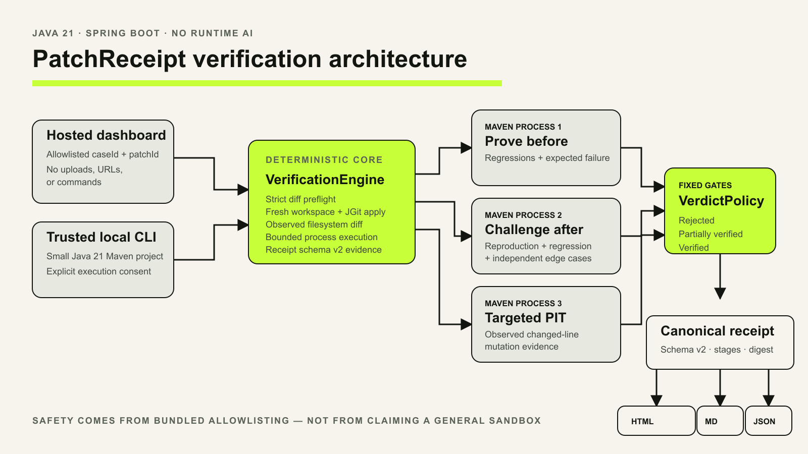

# PatchReceipt

> AI writes the patch. PatchReceipt proves whether it deserves to ship.

PatchReceipt is a model-agnostic verification layer for AI-generated Java patches. It accepts a unified diff regardless of whether it came from Codex, Claude Code, Cursor, Copilot, or another coding agent. It reproduces the reported bug on a pristine baseline, applies the patch, compares what actually changed on disk, reruns the proof, executes unchanged regressions and a sealed edge-case pack, challenges the evidence with changed-line mutation testing, and emits one evidence receipt as JSON, Markdown, and standalone HTML.

It uses no runtime LLM or API key.

**Live demo:** [patch-receipt-production.up.railway.app](https://patch-receipt-production.up.railway.app/)

The hosted demo is deliberately curated: it runs only bundled, hash-allowlisted
projects and patches. Developers can verify their own trusted Java 21 Maven
projects through the local CLI described below.



## What the demo proves

The bundled `checkout-core` case asks whether retried, case-insensitive coupon codes can be applied more than once.

| Candidate | Correctness evidence | Scope | Mutation | Verdict |
| --- | --- | --- | --- | --- |
| Plausible object `distinct()` fix | Reproduction fixed; 3 sealed edge cases fail | Clean | Skipped after correctness failure | `REJECTED` |
| Correct fix with unrelated edit | 6 regressions and 9 edge cases pass | Unexpected production path | 1/1 killed; below 2-mutant minimum | `PARTIALLY_VERIFIED` |
| Minimal robust fix | 6 regressions and 9 edge cases pass | Clean observed filesystem scope | 5/5 changed-line mutants killed | `VERIFIED` |

The hardened six-patch ground-truthed corpus matched all six expected verdicts
with zero unsafe `VERIFIED` outcomes. Its primary robust run completed in
38.944 seconds in the extended correctness harness, with every individual
stage below the production stage limit. This is a local observation, not a
deployed latency percentile. The exact final packaged Java 21 JAR separately
completed the same public robust flow through the production-config dashboard
in 25.943 seconds.

The Railway deployment was smoke-tested on 2 August 2026. The dashboard
returned HTTP 200, `/actuator/health` returned `UP`, and the three bundled
candidates produced `REJECTED`, `PARTIALLY_VERIFIED`, and `VERIFIED` as
expected. The robust production run completed in 6,652 ms with 6/6 regressions,
9/9 edge cases, clean observed scope, and 5/5 changed-line mutants killed. All
three receipt formats returned HTTP 200 with matching verdicts, and the tested
responses contained no local absolute path. This is one production smoke-test
sample, not a deployed p95 measurement.

## Run locally

Prerequisite: Java 21 or newer. Maven is bootstrapped by the checksum-verified wrapper and its dependencies stay under `.cache/maven`.

Windows:

```powershell
$env:MAVEN_USER_HOME = Join-Path (Get-Location) '.cache\maven'
.\mvnw.cmd verify
.\mvnw.cmd spring-boot:run
```

Unix:

```sh
export MAVEN_USER_HOME="$PWD/.cache/maven"
./mvnw verify
./mvnw spring-boot:run
```

Open `http://localhost:8080`.

The first run downloads the pinned Maven distribution and dependencies. Hosted/container execution is offline after its build cache has been prepared.

## Trusted-project CLI

Build the executable JAR:

```powershell
.\mvnw.cmd package
```

Scaffold a sealed verifier pack:

```text
java -jar target/patch-receipt-0.0.1-SNAPSHOT.jar init
  --output verifier-pack
```

Verify a small trusted Java 21 Maven project:

```text
java -jar target/patch-receipt-0.0.1-SNAPSHOT.jar verify
  --project <directory>
  --bug-report <markdown-file>
  --patch <unified-diff>
  --verifier-pack <directory>
  --output <directory>
  --allow-local-execution
```

Without `--allow-local-execution`, the CLI exits without running the project. Java builds and tests can execute arbitrary code; review local inputs first.

## Use it with an agentic coding tool

PatchReceipt sits after the coding agent and before merge:

```text
Coding agent -> unified diff -> PatchReceipt -> evidence receipt -> human or CI decision
```

1. Keep a clean copy of the small Maven project as the baseline.
2. Ask any coding agent to fix the bug on a branch or in a separate working tree.
3. Export the agent's change as a unified diff.
4. Run the trusted-project CLI with the baseline, bug report, diff, and a verifier pack prepared independently of the candidate patch.
5. Give the JSON or Markdown receipt back to the agent for another attempt, or require `VERIFIED` before merge.

PatchReceipt does not need to call the agent or know which model produced the change. The integration boundary is the ordinary unified diff, so it works offline and can be driven by a person, an agent loop, or CI. See [the agentic-AI workflow](docs/AGENTIC_AI_WORKFLOW.md) for a complete example and the important verifier-pack independence rule.

## Hosted API

The hosted surface accepts identifiers only:

- `GET /api/v1/cases`
- `POST /api/v1/runs` with `{ "caseId": "...", "patchId": "..." }`
- `GET /api/v1/runs/{runId}`
- `GET /api/v1/runs/{runId}/receipt.json`
- `GET /api/v1/runs/{runId}/receipt.md`
- `GET /api/v1/runs/{runId}/receipt.html`
- `GET /actuator/health`

There is no upload, URL, repository, source, command, path, or test-content field in the public API.

## Verdict policy

- `REJECTED`: a mandatory correctness or safety gate fails.
- `PARTIALLY_VERIFIED`: correctness passes, but observed scope drifts or mutation evidence is unhealthy, incomplete, missing for a changed file, or below threshold.
- `VERIFIED`: reproduction, regressions, edge cases, observed scope, mutation-process health, file-level mutation coverage, the mutation threshold, and the minimum of two viable changed-line mutants all pass.

A weighted trust score never overrides these rules.

## Safety boundary

The public service executes only bundled, hash-allowlisted project, patch, manifest, bug-report, and verifier-pack inputs. It uses strict preflight plus post-apply filesystem reconciliation, a single-worker bounded queue, stage and run limits, capped logs/workspaces, argument-array process execution, process-tree termination, path validation, Maven offline mode, scratch workspaces, centrally sanitised evidence, and a non-root container user. Maven offline mode is not a network-egress firewall.

The container is not presented as a secure arbitrary-code sandbox. Arbitrary hosted repository execution is intentionally unsupported. See [docs/SECURITY.md](docs/SECURITY.md).

## Architecture and evidence

- [Approved product plan](PROJECT_PLAN.md)
- [Architecture](docs/ARCHITECTURE.md)
- [Security model](docs/SECURITY.md)
- [Deployment guide](docs/DEPLOYMENT.md)
- [Agentic-AI workflow](docs/AGENTIC_AI_WORKFLOW.md)
- [Evaluation](docs/EVALUATION.md)
- [Demo script](docs/DEMO_SCRIPT.md)
- [Submission document](docs/SUBMISSION_DOCUMENT.md)
- [Presentation](docs/PRESENTATION.pptx) and [PDF export](docs/PRESENTATION.pdf)
- [Tester protocol](docs/TESTER_SCRIPT.md)
- [Final submission checklist](docs/SUBMISSION_CHECKLIST.md)
- [Codex implementation journal](CODEX_JOURNAL.md)
- [Claude review handoff](CLAUDE_HANDOFF.md)
- [Review decisions](REVIEW_DECISIONS.md)

## Build integrity

- Java release target: 21
- Spring Boot: 4.1.0
- Maven Wrapper: 3.3.4
- Maven: 3.9.16 with SHA-256 distribution verification
- PIT: 1.25.4
- JGit: 7.7.0

CI runs the focused safety suite on Windows, the full vertical slice and live PIT evidence on Ubuntu, then builds and smoke-tests the production container.

## AI use

Codex is the primary builder and owns planning, architecture, implementation, tests, debugging, integration, deployment preparation, evaluation, and submission assets. Its milestone decisions and failing-to-passing loops are recorded in `CODEX_JOURNAL.md` and Git history.

Claude Code is an independent reviewer through `CLAUDE_HANDOFF.md`, `reviews/claude/`, and `REVIEW_DECISIONS.md`; it is not the primary implementation agent. PatchReceipt itself does not call OpenAI or Anthropic at runtime.

## Licence

Apache License 2.0.
