# PatchReceipt architecture

## Status and scope

This document describes the repository as implemented on 2026-07-25. PatchReceipt is a single Java 21 and Spring Boot 4.1 Maven application with two entry points:

- a public-facing web application for three bundled patch candidates; and
- a command-line interface for explicitly trusted, local Java 21 Maven projects.

The repository contains a Dockerfile and Railway configuration, but deployment has not yet been performed or verified. The hosted boundary described below is therefore the application’s implemented deployment design, not a claim that a public service is already running.

PatchReceipt is deterministic at runtime. It does not call an LLM or any external AI API. A sealed JUnit verifier pack supplies the reproduction and independent edge-case tests.

## System view

```mermaid
flowchart LR
    Browser["Browser dashboard"] --> WebAPI["Spring MVC API"]
    WebAPI --> Registry["RunRegistry<br/>1 worker, queue of 3"]
    Registry --> Bundled["BundledCaseRepository<br/>allowlisted case and patch IDs"]

    LocalUser["Trusted local user"] --> CLI["Picocli CLI<br/>explicit execution acknowledgement"]
    CLI --> LocalLoader["LocalCaseLoader"]

    Bundled --> Case["VerificationCase<br/>manifest, project, verifier pack, patch, hashes"]
    LocalLoader --> Case
    Case --> Engine["VerificationEngine"]

    Engine --> Scope["ScopeAnalyzer<br/>preflight before execution"]
    Engine --> Workspace["WorkspaceManager<br/>fresh baseline and patched copies"]
    Engine --> Apply["JGit PatchApplier"]

    Workspace --> Baseline["Maven process 1<br/>baseline regressions + reproduction"]
    Apply --> Patched["Maven process 2<br/>patched reproduction + regressions + edge cases"]
    Patched --> PIT["Maven process 3<br/>targeted PIT, correctness permitting"]

    Baseline --> Surefire["SurefireReportParser"]
    Patched --> Surefire
    PIT --> PitParser["PitestReportParser"]
    Scope --> Evidence["Canonical domain evidence"]
    Surefire --> Evidence
    PitParser --> Evidence
    Evidence --> Policy["VerdictPolicy"]
    Policy --> Receipt["VerificationReceipt"]
    Receipt --> Digest["ReceiptDigestService<br/>SHA-256 over canonical JSON without digest field"]
    Digest --> JSON["JSON renderer"]
    Digest --> Markdown["Markdown renderer"]
    Digest --> HTML["Escaped standalone HTML renderer"]

    JSON --> CLI
    Markdown --> CLI
    HTML --> CLI
    JSON --> Downloads["Receipt API"]
    Markdown --> Downloads
    HTML --> Downloads
```

The same system is available as editable Mermaid source
([`architecture.mmd`](architecture.mmd)) and as submission-ready
[`SVG`](architecture.svg) and [`PNG`](architecture.png) exports.

## Package boundaries

| Package | Current responsibility |
| --- | --- |
| `dev.patchreceipt` | Bootstraps either the Spring MVC server or the non-web CLI application context. |
| `casepack` | Parses manifests, loads bundled or trusted-local inputs, rejects unsafe local paths, materializes project and verifier files, and computes input hashes. |
| `cli` | Implements `init` and `verify` with Picocli, including the explicit local-execution acknowledgement and three receipt files. |
| `domain` | Defines immutable receipt, stage, test, mutation, scope, reproduction, and verdict records. |
| `engine` | Orchestrates verification, records stage evidence, applies fixed verdict rules, manages workspaces, and emits the canonical receipt. |
| `parsers` | Securely parses Surefire and PIT XML reports into domain evidence. |
| `receipt` | Calculates the receipt digest and renders the same `VerificationReceipt` as JSON, Markdown, and standalone escaped HTML. |
| `runner` | Applies patches with JGit and launches bounded Maven processes using argument arrays. |
| `scope` | Parses unified-diff metadata and enforces expected, forbidden, file-count, line-count, binary, and traversal rules. |
| `web` | Exposes the one-page dashboard, allowlisted asynchronous run API, in-memory job registry, and receipt downloads. |

The repository intentionally remains one Maven module. These are logical boundaries, not separately deployed services.

## Input models and trust boundaries

### Bundled web cases

`BundledCaseRepository` accepts one case ID, `checkout-coupons`. Its hosted patch set is an explicit in-code set containing:

- `plausible-distinct`;
- `correct-with-drift`; and
- `minimal-robust`.

The larger manifest also contains internal evaluation candidates, but `loadHosted` does not expose those candidates to web callers. Project files and sealed verifier files are read from indexed classpath resources. The loader computes SHA-256 hashes for the manifest, bug report, patch, project tree, and verifier pack and carries them into the receipt.

The web API never accepts a repository, raw patch, verifier source, filesystem path, command, Maven goal, or URL. Allowlisting is the primary hosted safety boundary.

### Trusted local CLI

`PatchReceiptApplication` detects the `verify` and `init` commands and starts Spring without a web server. `verify` refuses to run unless `--allow-local-execution` is present because Maven projects and verifier tests can execute arbitrary code.

`LocalCaseLoader` accepts only a Java 21 Maven manifest, requires a `pom.xml`, rejects symbolic links in accepted inputs, normalizes verifier paths, excludes generated and repository directories, limits input to 1,000 files and 8 MiB, and computes the same input hashes as the bundled loader. It does not make local code safe; it only constrains intake and requires an explicit acknowledgement.

Both loaders produce a `VerificationCase`: a manifest, candidate metadata, bug report, unified diff, immutable project and verifier byte maps, and input hashes.

## Optimized verification pipeline

A successful verification uses three child Maven invocations. Scope analysis, workspace setup, patch application, parsing, verdict calculation, digesting, and rendering run inside the PatchReceipt JVM.

### 1. Scope preflight

`ScopeAnalyzer` parses the unified diff before any child process starts. It records paths, additions, deletions, and changed new-line numbers. Empty, malformed, binary, traversal, forbidden-path, over-file-limit, and over-line-limit patches produce hard violations. Unexpected production paths produce warnings.

A hard scope violation returns `REJECTED` immediately. A warning allows correctness verification to continue but prevents `VERIFIED`.

### 2. Fresh baseline and patched workspaces

`WorkspaceManager` creates one unique run directory beneath `.patchreceipt-work`, with separate `baseline` and `patched` directories. It materializes the same pristine project into each. The sealed verifier pack is copied only into these temporary workspaces, never into the bundled source fixture.

### 3. Maven process 1: shared baseline tests

The verifier pack is injected into the baseline copy. One Maven invocation selects both:

- the original regression class; and
- the named reproduction class.

The process is expected to return non-zero because the reproduction should fail. PatchReceipt therefore does not treat the process exit code alone as the result. `SurefireReportParser` reads each selected class separately:

- the original regression class must have executed and passed; and
- exactly one reproduction test must have executed and failed with the manifest’s expected assertion type.

A compilation error, timeout, missing report, unrelated error, passing reproduction, or unhealthy baseline is not accepted as bug reproduction.

### 4. Patch application

JGit initializes the fresh patched copy and applies the unified diff. An application failure is a mandatory rejection. Compilation is then exercised by the shared patched Maven test process.

### 5. Maven process 2: shared patched tests

The same sealed verifier pack is injected into the patched copy. One Maven invocation selects:

- the same reproduction class;
- the unchanged original regression class; and
- the independent dynamic edge-case class.

Surefire XML is again parsed separately for all three evidence gates. The reproduction must now pass, every original regression must pass, and every generated edge case must pass. Sharing one Maven launch reduces startup cost without merging the evidence or verdict rules.

### 6. Maven process 3: targeted PIT

PIT runs only when all mandatory correctness gates are still clear. The bundled fixture targets `CheckoutCalculator`, uses one PIT thread, and produces XML and HTML reports. `PitestReportParser` intersects PIT findings with the changed line numbers reported by scope analysis.

The receipt reports viable changed-line mutants, killed and surviving mutants, uncovered mutants, errors/timeouts, score, threshold, and provenance. `VERIFIED` requires conclusive evidence, at least one changed-line mutant, and a score of at least 80%. Inconclusive or below-threshold mutation evidence yields `PARTIALLY_VERIFIED`, not `REJECTED`.

### 7. Size check, verdict, and cleanup

After execution, PatchReceipt measures the run workspace against the manifest limit. Exceeding it is a blocking reason. `VerdictPolicy` then applies precedence:

1. any blocking correctness, execution, or hard-scope reason means `REJECTED`;
2. otherwise, any scope warning or incomplete mutation confidence means `PARTIALLY_VERIFIED`;
3. only clean scope plus complete passing correctness and mutation evidence means `VERIFIED`.

No weighted score can override a mandatory failure. The workspace is deleted in the engine’s `finally` block unless development configuration explicitly keeps workspaces.

## Canonical evidence and receipt flow

`VerificationEngine` aggregates one immutable `VerificationReceipt` containing:

- schema, receipt, engine, case, and patch identifiers;
- start, completion, and duration metadata;
- final verdict, blocking reasons, and warnings;
- input hashes and toolchain details;
- ordered `StageResult` records and sanitized stage logs;
- before/after reproduction evidence;
- baseline and patched regression evidence;
- independent edge-case evidence;
- changed-line mutation evidence; and
- scope paths, counts, changed lines, violations, and warnings.

`ReceiptDigestService` serializes that record with properties and map keys sorted, removes `receiptDigest`, and hashes the remaining canonical JSON bytes with SHA-256. It then returns a new receipt with the digest attached. The digest provides traceability and parity checking; it is not a signature and does not establish who produced the receipt.

All outputs consume that same digest-bearing record:

- `JsonReceiptRenderer` writes pretty JSON;
- `MarkdownReceiptRenderer` emits deterministic tables, lists, metrics, and logs; and
- `HtmlReceiptRenderer` emits a standalone document and escapes all evidence text.

The CLI writes `receipt.json`, `receipt.md`, and `receipt.html`. The web receipt controller renders those same three formats from the completed in-memory receipt. Renderer tests check verdict and evidence parity.

## Web request lifecycle

The implemented endpoints are:

- `GET /` — the Thymeleaf dashboard;
- `GET /api/v1/cases` — the bundled case, bug report, and three hosted diffs;
- `POST /api/v1/runs` — accepts only `{caseId, patchId}`;
- `GET /api/v1/runs/{runId}` — queued/running/completed state and completed stages;
- `GET /api/v1/runs/{runId}/receipt.json`;
- `GET /api/v1/runs/{runId}/receipt.md`;
- `GET /api/v1/runs/{runId}/receipt.html`; and
- `GET /actuator/health`.

`RunRegistry` stores jobs and receipts in memory. A single worker serializes Maven execution, three additional jobs may wait, and excess submissions receive HTTP 429. Completed jobs expire after 30 minutes when the registry next purges. The dashboard polls run state and follows the receipt links after completion.

There is no database, account model, authentication, or durable run history.

## Build and container shape

The application targets Java 21 and pins Maven 3.9.16 through Maven Wrapper 3.3.4 with distribution checksum verification. The Dockerfile:

- builds and runs the vertical-slice integration test in a Java 21 build image;
- packages the Spring Boot JAR;
- copies the verified Maven runtime and warmed project-local dependency cache;
- runs the application as numeric non-root UID/GID `10001`;
- prepares `.patchreceipt-work`; and
- starts the application with a bounded JVM RAM percentage and two visible processors.

`railway.json` selects the Dockerfile and `/actuator/health`. These files are deployment preparation only; no public deployment is asserted by this document.

## Deliberate limitations

- The hosted service does not execute arbitrary repositories or patches.
- The CLI supports only trusted Java 21 Maven projects.
- Edge cases come from a prewritten sealed verifier pack, not natural-language generation.
- Scope analysis enforces declared paths and size, not semantic intent.
- Input and receipt hashes are traceability evidence, not signatures.
- State is in memory and disappears on restart.
- There is currently a per-Maven-process timeout, but no separate whole-verification deadline.
- The current workspace byte limit is checked after child execution, not enforced as a live filesystem quota.

See [`SECURITY.md`](SECURITY.md) for the threat model and residual risks.
